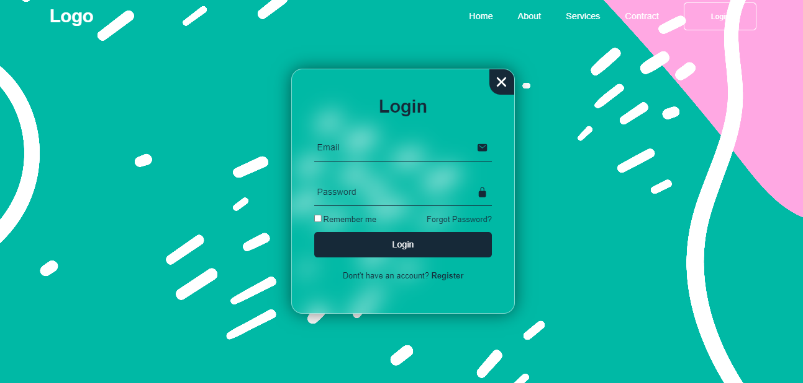
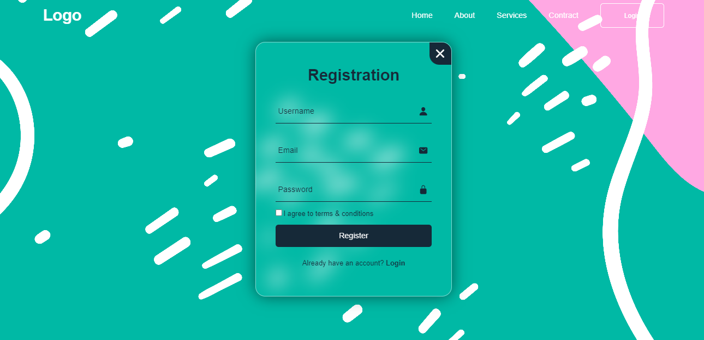

# Indrudução
Nessa atividade teriamos que utilizar uma página web de login para ativar Pop Ups de Alert, e página para registrar-se.
Nesse caso criei minha página do zero com ajuda de um canal do Youtube Codehal!
Aprendi bastante, veja a interface: 
# Interface

# Tecnologias utilizadas
* HTML5
* CSS
* Java Script
* GitHub
* Linkedin